<h1 align="center">Hi 👋, I'm hoody</h1>

Connect @ 🛜➖🛜➖🛜  
&nbsp;&nbsp;
&nbsp;&nbsp;
&nbsp;&nbsp;

<h3> 👩🏻‍💻 Penetration Tester | 💻 CyberSecurity Engineer | 🚀 Red Teamer </h3> 

  

  

- 🤔 What if life comes after death?

- 📫 Reach me at **kunaljaglan14@gmail.com**

- 👨‍💻 All of my writeups are available at [hashnode](https://hoody.hashnode.dev)

- 🚀 Postponing-sleep, it's a hacker life for me

<h3>Rank On TryHackMe</h3>

 

